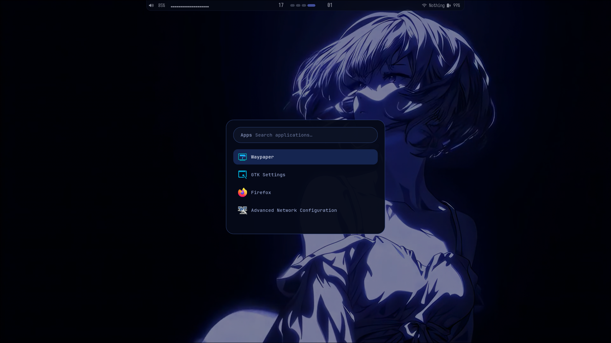
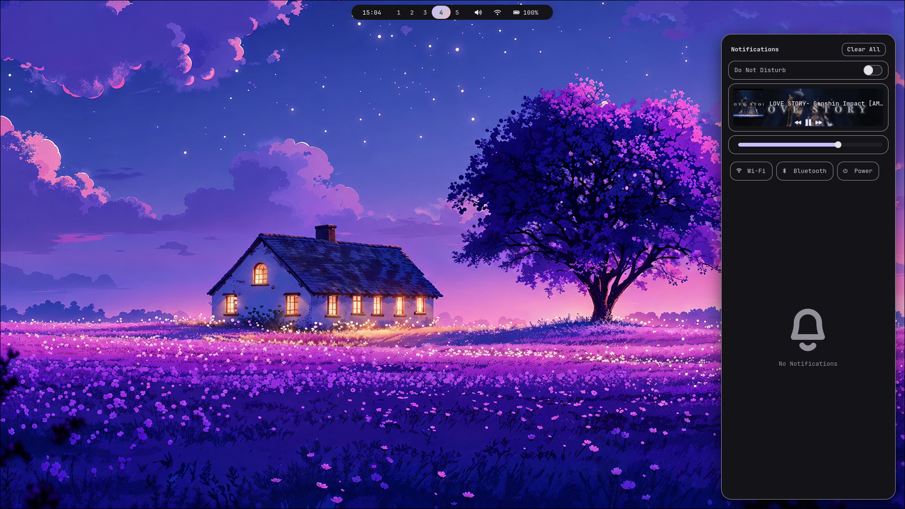

<div align="center">

# 🖥️ Hyprland Setup

A clean, modern, and modular **Hyprland** dotfiles configuration for **Arch Linux**.

Built around a minimal Wayland workflow with **Waybar**, **Rofi**, **Kitty**, **Fish**, **SwayNC**, **Hyprlock**, and **Neovim**.
[demo.mp4](assets/demo.mp4)
<!-- Badges: replace the repo URL placeholders below once published -->


<!-- TODO: Replace <username>/<repo> with your actual GitHub path -->


</div>

---

> 💡 **Tip:** Star ⭐ this repository if you find it useful — it helps others discover the project.

## 📸 Preview

<!-- TODO: Replace these placeholders with your own screenshots once available -->

<details>
<summary><strong>Desktop</strong></summary>


</details>

<details>
<summary><strong>Terminal</strong></summary>


</details>

<details>
<summary><strong>Application Launcher</strong></summary>



</details>

<details>
<summary><strong>Notification Center</strong></summary>



</details>

> ⚠️ **Note:** A dedicated lock screen screenshot is not yet included. Add one at `screenshots/lockscreen.png` and reference it here once captured.

---

## ✨ Features

- 🪟 **Hyprland** — modular, Lua-based configuration split across logical files (keybindings, animations, monitors, input, window rules, etc.)
- 📊 **Waybar** — custom status bar with its own colors and styling
- 💻 **Kitty** — configured Terminal emulator
- 🐟 **Fish** — shell configuration with custom functions, completions, and themes
- 🚀 **Rofi** — application launcher with a custom theme
- 🔔 **SwayNC** — notification center with custom styling
- 🔒 **Hyprlock** — configured lock screen
- 📝 **Neovim** — Lua-based editor configuration with plugin support
- 🖼️ **Wallpapers** — a curated collection of static and animated wallpapers
- 🧩 **Modular configuration** — Hyprland settings are split into reusable modules instead of one large file
- 📦 **Automated installer** — a single script handles packages, backups, configs, and wallpapers

> ℹ️ **Info:** Features listed above reflect what is currently present in this repository. Additional tools may be added over time.

---

## 🗂️ Repository Structure

```text
Hyprland-setup/
├── config/
│   ├── fish/         # Fish shell config, functions, completions, themes
│   ├── hypr/          # Hyprland config (modular Lua), hyprlock.conf, helper scripts
│   ├── kitty/         # Kitty Terminal configuration
│   ├── nvim/          # Neovim configuration (Lua-based)
│   ├── rofi/          # Rofi launcher config and theme
│   ├── swaync/        # SwayNC notification center config and styling
│   └── waybar/        # Waybar config, colors, and styling
├── Wallpapers/         # Wallpaper collection (images and videos)
├── screenshots/         # Preview images used in this README
├── scripts/
│   ├── backup.sh              # Backs up existing ~/.config directories before install
│   ├── install-packages.sh    # Installs required pacman/AUR/flatpak packages
│   ├── install-configs.sh     # Copies config/ into ~/.config
│   └── install-wallpapers.sh  # Copies wallpapers into ~/Pictures/Wallpapers
├── install.sh           # Main installer, runs the scripts above in order
└── README.md
```

### 📁 Directory Overview

| Path | Description |
|------|-------------|
| `config/hypr/` | Core Hyprland configuration, split into modules (`monitor.lua`, `keybindings.lua`, `animations.lua`, `input.lua`, `window.lua`, `window_rule.lua`, `look.lua`, `env.lua`, `misc.lua`, `autostart.lua`), plus `hyprlock.conf` and helper shell scripts |
| `config/waybar/` | Waybar configuration (`config.jsonc`), styling (`style.css`), color definitions, and a launch script |
| `config/kitty/` | Kitty Terminal configuration |
| `config/fish/` | Fish shell config, functions, completions, plugins, and themes |
| `config/rofi/` | Rofi configuration and `.rasi` theme |
| `config/swaync/` | SwayNC configuration and styling |
| `config/nvim/` | Neovim configuration entry point and Lua modules (options, keymaps, autocmds, plugins) |
| `Wallpapers/` | Wallpaper images and videos used with the desktop background |
| `screenshots/` | Images referenced in this README's Preview section |
| `scripts/` | Helper scripts called by `install.sh` |

---

## ✅ Requirements

Before installing, make sure you have:

- 🐧 A fresh or existing **Arch Linux** installation
- 📦 `git` installed
- 🛠️ An AUR helper (`yay` is installed automatically by the installer if missing; `paru` works as an alternative)
- 🌐 An active internet connection

> ⚠️ **Warning:** Review `scripts/install-packages.sh` and `install.sh` before running them. The installer modifies your `~/.config` directory and may reboot your system at the end.

---

## 📦 Installation

```bash
# Clone the repository
# TODO: Replace <username>/<repo> with the actual GitHub path
git clone https://github.com/Sharvesh93/Hyprland-setup.git

# Move into the project directory
cd Hyperland-setup

# Make the installer executable
chmod +x install.sh

# Run the installer
./install.sh
```

What each step does:

1. **`git clone ...`** — downloads the repository to your machine.
2. **`cd Hyprland-setup`** — enters the project directory.
3. **`chmod +x install.sh`** — grants execute permission to the installer.
4. **`./install.sh`** — runs the full setup: installs packages, backs up existing configs, copies new configs into `~/.config`, installs wallpapers, and optionally reboots at the end.

---

## 📥 Packages Installed

Running `install.sh` automatically executes `scripts/install-packages.sh`, which installs all required packages via `pacman`, builds and installs `yay` if it isn't already available, installs additional packages from the AUR, and installs select applications via `flatpak`. You do not need to install dependencies manually — the script handles this for you.

> 💡 **Tip:** Open `scripts/install-packages.sh` to see or customize the exact list of packages before running the installer.

---

## ⚙️ Configuration

All configuration files live under the `config/` directory and mirror the structure of `~/.config`. During installation, `scripts/install-configs.sh` copies everything from `config/` directly into `~/.config`, so the resulting layout (e.g. `~/.config/hypr`, `~/.config/waybar`, `~/.config/kitty`) matches this repository exactly.

> ⚠️ **Warning:** Existing configuration directories for `hypr`, `waybar`, `kitty`, `fish`, `rofi`, `swaync`, and `nvim` are backed up by `scripts/backup.sh` before being overwritten, but it's good practice to review your own setup beforehand.

---

## 🔄 Updating

To update your setup after pulling new changes from GitHub:

```bash
cd Hyprland-setup
git pull
./install.sh
```

This re-runs the full installation flow, including backing up your current configs and copying the updated files into `~/.config`.

> 💡 **Tip:** If you only want to refresh configuration files without reinstalling packages, you can run `./scripts/install-configs.sh` directly instead of the full `install.sh`.

---

## ⌨️ Keybindings

Hyprland keybindings are defined inside `config/hypr/modules/keybindings.lua`. A helper script, `config/hypr/help-bindings.sh`, is also included to assist with viewing bindings.

You're encouraged to open this file and adjust keybindings to match your workflow — the modular structure makes it easy to find and edit just the bindings without touching the rest of the Hyprland configuration.

---

## 🎨 Customization

This setup is designed to be modified. Common customization points include:

- 🖼️ **Wallpapers** — add or replace files in `Wallpapers/`, then update `config/hypr/start-wallpaper.sh` or your wallpaper tool of choice
- 📊 **Waybar** — edit `config/waybar/config.jsonc` for modules/layout and `config/waybar/style.css` (with `config/waybar/colors/`) for appearance
- 💻 **Kitty theme** — edit `config/kitty/kitty.conf`
- 🔤 **Fonts** — adjust font settings inside the relevant app configs (Kitty, Waybar, Rofi)
- 🎨 **Colors** — most components reference color files or variables that can be edited independently (e.g. `config/waybar/colors/`)
- 🖥️ **Monitor configuration** — edit `config/hypr/modules/monitor.lua` to match your display setup

---

## 🖼️ Screenshots

<!-- TODO: Add or update screenshots as the setup evolves -->


---

## 🙌 Credits

This setup builds on top of these excellent open-source projects:

- [Hyprland](https://github.com/hyprwm/Hyprland)
- [Waybar](https://github.com/Alexays/Waybar)
- [Kitty](https://github.com/kovidgoyal/kitty)
- [Fish shell](https://github.com/fish-shell/fish-shell)
- [Rofi](https://github.com/davatorium/rofi)
- [SwayNC](https://github.com/ErikReider/SwayNotificationCenter)
- [Neovim](https://github.com/neovim/neovim)

---

## 📄 License

This project is licensed under the **MIT License**.
<!-- TODO: Add a LICENSE file to the repository root if it does not already exist -->

---

## 📝 Notes

> ℹ️ **Info:** This setup is primarily designed and tested for **Arch Linux**. It relies on `pacman`, AUR helpers, and `flatpak`, so adapting it to other distributions will require manually replacing the package installation steps with the equivalent commands for your distribution. The configuration files themselves (Hyprland, Waybar, Kitty, etc.) should remain largely portable.

<div align="center">

Made with ❤️ using Hyprland on Arch Linux.

</div>
