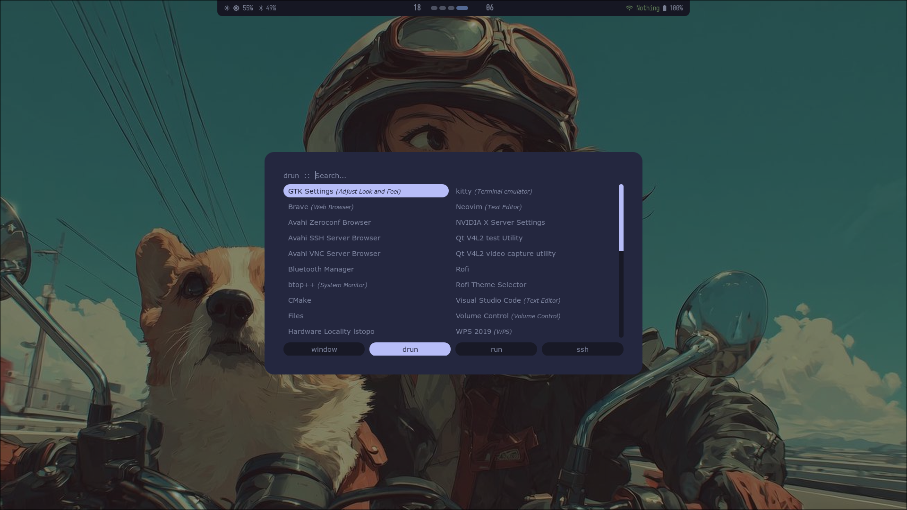
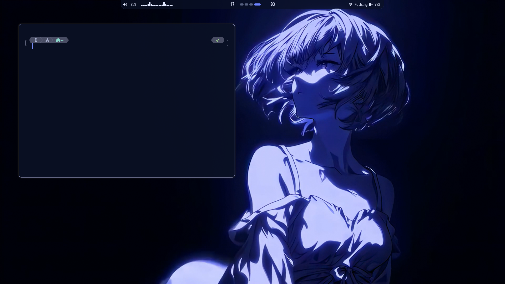
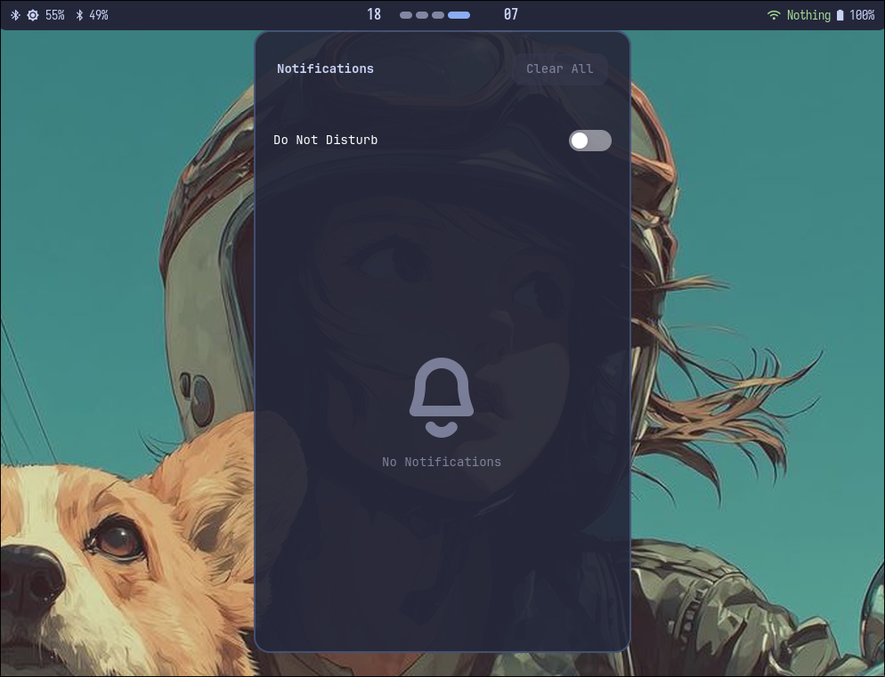

<div align="center">

# 🖥️ Hyprland Setup

A clean, modern, and customizable **Hyprland** configuration for **Arch Linux**.

Featuring a minimal workflow with **Waybar**, **Rofi**, **Kitty**, **Ghostty**, **SwayNC**, **Fastfetch**, **Neovim**, and custom wallpapers.

---

<!-- Add badges later -->


</div>

---

# 📸 Screenshots

> **Desktop**


---

> **Launcher**



---

> **Terminal**



---

> **Notifications**



---

# ✨ Features

- 🎨 Clean and minimal Hyprland configuration
- 🖥️ Waybar with custom styling
- 🚀 Rofi launcher
- 💻 Kitty terminal configuration
- 👻 Ghostty terminal configuration
- 🔔 SwayNC notification center
- ⚡ Fastfetch configuration
- 📝 Neovim configuration
- 🖼️ Wallpaper collection
- 📦 Simple installation script

---

# 📂 Repository Structure

```
.
├── Fastfetch/
├── Wallpapers/
├── ghostty/
├── hypr/
├── kitty/
├── nvim/
├── rofi/
├── swaync/
├── waybar/
├── install.sh
├── wallpaper.sh
└── README.md
```

---

# 📁 Directory Overview

| Directory | Description |
|-----------|-------------|
| `hypr/` | Hyprland configuration files |
| `waybar/` | Waybar configuration and styling |
| `rofi/` | Rofi launcher configuration |
| `kitty/` | Kitty terminal configuration |
| `ghostty/` | Ghostty terminal configuration |
| `nvim/` | Neovim configuration |
| `swaync/` | Notification center configuration |
| `Fastfetch/` | Fastfetch configuration |
| `Wallpapers/` | Wallpaper collection |

---

# 📦 Installation

Clone the repository

```bash
git clone https://github.com/Sharvesh93/Hyprland-setup.git
```

Move into the project directory

```bash
cd Hyprland-setup
```

Make the installer executable

```bash
chmod +x install.sh
```

Run the installer

```bash
./install.sh
```

---

# ⚙️ Dependencies

Install the required packages before using the configuration.

Core Components

- Hyprland
- Waybar
- Rofi
- Kitty
- Ghostty
- SwayNC
- Neovim
- Fastfetch

Utilities

- grim
- slurp
- wl-clipboard
- playerctl
- brightnessctl
- networkmanager
- pipewire
- wireplumber
- pavucontrol

---

# ⌨️ Default Keybindings

| Shortcut | Action |
|-----------|--------|
| `SUPER + T` | Open Terminal |
| `SUPER + Space` | Open Rofi |
| `SUPER + Q` | Close Active Window |
| `SUPER + F` | Toggle Fullscreen |
| `SUPER + Shift + Q` | Exit Hyprland |

> Modify these according to your `hypr/binds.conf`.

---

# 🎨 Customization

You can customize:

- Wallpapers
- Waybar theme
- Rofi theme
- Terminal appearance
- Fonts
- Window gaps
- Blur
- Animations
- Keybindings

Most configuration files are located inside their respective directories.

---

# 🚧 Roadmap

- [x] Hyprland configuration
- [x] Waybar
- [x] Kitty
- [x] Ghostty
- [x] Neovim
- [x] SwayNC
- [ ] Automatic dependency installer
- [ ] Multi-monitor support
- [ ] GTK theme installer
- [ ] Hyprlock integration
- [ ] Hypridle integration

---

# 🤝 Contributing

Contributions, suggestions, and improvements are welcome.

If you find a bug or have an idea, feel free to open an issue or submit a pull request.

---

# ⭐ Support

If you found this repository useful, consider giving it a ⭐ on GitHub.

---

# 📄 License

This project is licensed under the MIT License.

---

<div align="center">

Made with ❤️ using Hyprland on Arch Linux.

</div>

